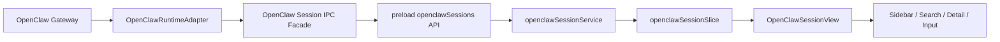
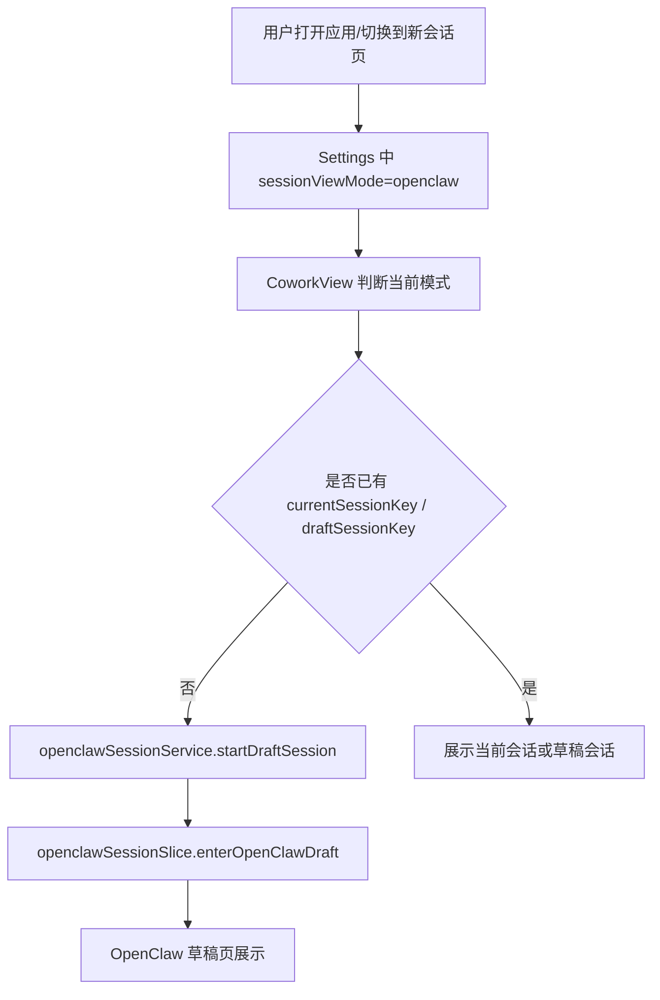
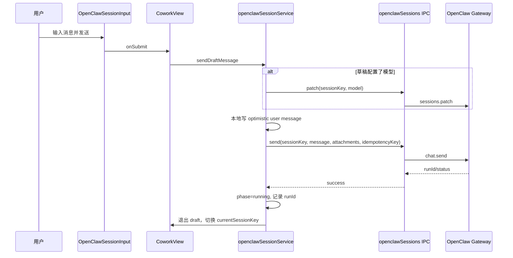
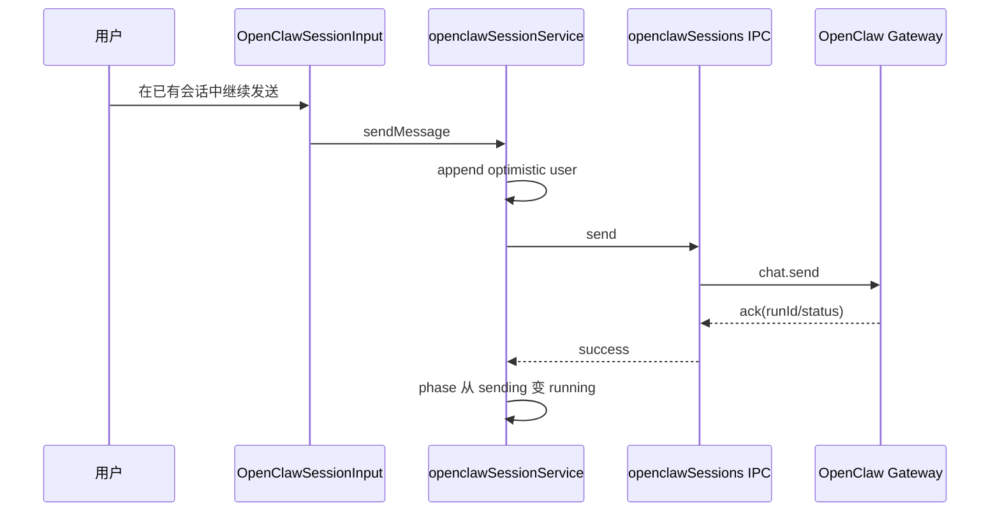
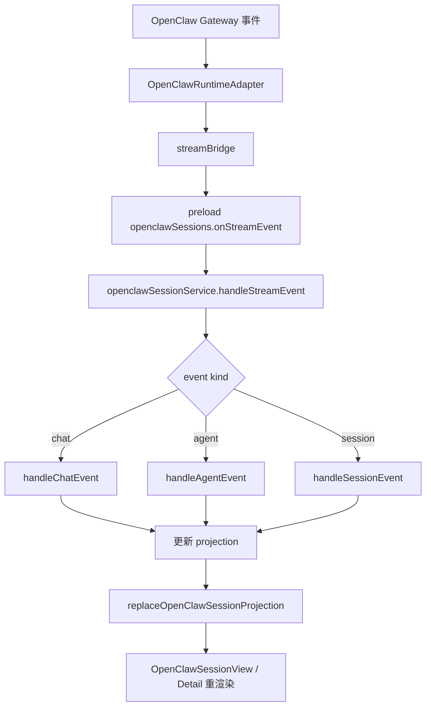
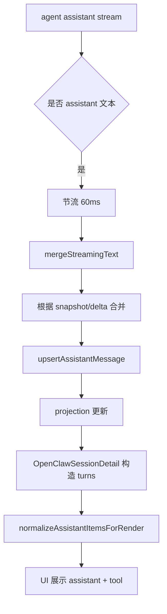
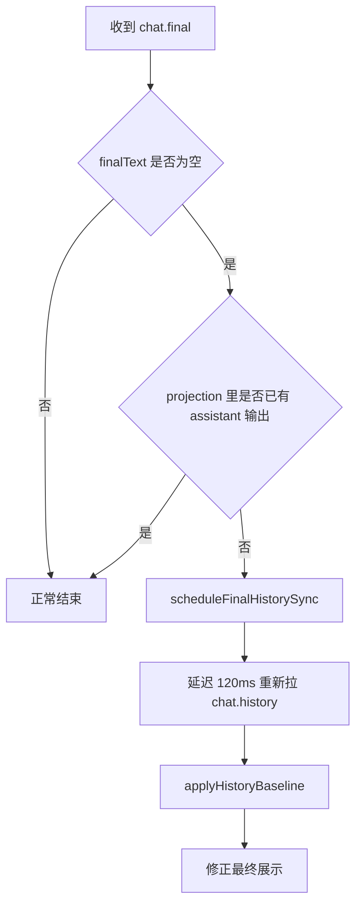
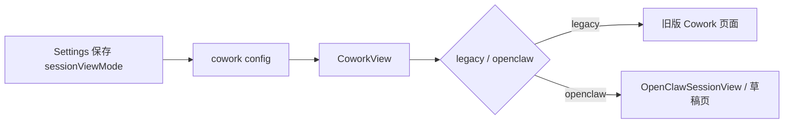

# OpenClaw 会话页重构设计说明

## 1. 文档目的

本文档用于记录本轮 `OpenClaw Session View` 重构的背景、目标、架构、关键流程与兜底策略，作为后续继续演进新会话页实现时的参考基线。

本文档聚焦以下问题：

- 在尽量不继续侵入历史 `cowork` 逻辑的前提下，引入一套新的 OpenClaw 会话列表与会话详情实现。
- 统一 OpenClaw 会话的列表、历史加载、流式消息展示、草稿态发送与会话级 UI。
- 解决历史实现中与 OpenClaw Gateway 事件模型不匹配导致的消息缺失、顺序错乱、重复展示和 UI 交互不一致问题。

---

## 2. 背景与改动原因

历史 `cowork` 页面最初是围绕本地 `cowork_sessions / cowork_messages` 这一套数据模型构建的。切换到 OpenClaw 作为主引擎后，前端需要处理的事实来源已经变成：

- OpenClaw Gateway 的 `sessions.list / chat.history / chat.send / chat.abort / sessions.patch`
- Gateway WebSocket / runtime bridge 推送的 `chat`、`agent`、`session projection` 事件
- 多种 session key 形态
  - 本地受管会话
  - channel 会话
  - main agent 会话
  - 非 main agent 会话

继续在旧版 `cowork` 页面里硬补 OpenClaw 特性，会产生以下问题：

- 历史代码路径过长，OpenClaw 语义和原始 Cowork 语义混杂。
- 会话列表与详情页都依赖旧消息模型，难以正确表达工具流、流式文本和 Gateway 历史回放。
- 新需求需要同时兼容：
  - 草稿态新建会话
  - IM / channel 会话
  - 主会话不可删除
  - 按 agent 过滤可见会话
  - OpenClaw 专属的 patch / abort / history sync 行为

因此本轮采用的策略是：

- 保留旧 `cowork` 页面。
- 新增独立的 `openclawSessions` 视图实现。
- 只在必要边界上对旧代码做最小侵入改造，用于：
  - 视图模式切换
  - 复用输入框能力
  - 共用配置与草稿状态

---

## 3. 改动目标

本轮改动的直接目标如下：

1. 提供一套独立的新会话页，专门面向 OpenClaw Gateway 会话。
2. 新会话页支持：
   - 左侧会话列表
   - 搜索
   - 草稿态新建会话
   - 会话历史查看
   - 继续发送消息
   - 中止、重命名、置顶、删除、改模型
3. 消息展示需要正确处理：
   - 用户消息
   - assistant 文本
   - 工具调用
   - 工具结果
   - 历史回放
   - channel 用户消息补投影
4. 解决以下已暴露问题：
   - assistant 最终结果不显示
   - channel 用户消息不显示
   - assistant 文本与工具调用顺序错误
   - assistant 文本重复渲染
   - 流式阶段 renderer CPU 偏高
5. 让设置、侧边栏、首页草稿页与新会话页之间形成统一切换体验。

---

## 4. 总体设计

### 4.1 设计原则

- **新能力尽量放到新路径**：OpenClaw 会话相关 UI 与状态管理独立实现。
- **旧逻辑只做桥接**：只在 `Settings / Sidebar / CoworkView / CoworkPromptInput` 等历史入口做最小接入。
- **主数据源前移到 Gateway**：列表、历史、发送、patch、abort 都以 OpenClaw Session IPC 为准。
- **前端维护 projection**：历史基线 + 流式事件合并，由 renderer 侧维护当前投影状态。
- **优先保证最终一致性**：流式投影可以先展示，必要时通过 history reload 兜底纠正。

### 4.2 模块划分

### 4.3 关键模块

#### Main 侧

- `src/main/ipcHandlers/openclawSession/`
  - 提供 `list / getHistory / send / abort / delete / patch / streamEvent`
- `src/main/libs/openclawSessionFacade.ts`
  - 对 Gateway request 做一层面向前端的包装
- `src/main/ipcHandlers/openclawSession/streamBridge.ts`
  - 将 adapter 层事件桥接成 renderer 可消费的统一 stream event
- `src/main/ipcHandlers/openclawSession/helpers.ts`
  - 将 Gateway session 原始结构映射为前端列表项结构

#### Renderer 侧

- `src/renderer/store/slices/openclawSessionSlice.ts`
  - 新会话页状态中心
- `src/renderer/services/openclawSessionService.ts`
  - OpenClaw 会话服务
  - 负责 list/history/send/abort/patch
  - 负责 stream event → projection
  - 负责 unread / drift / sending 状态
- `src/renderer/components/openclawSessions/`
  - 列表、详情、搜索、输入框、toolbar、懒渲染 turn 组件

---

## 5. 对历史代码的侵入范围

本轮不是完全零侵入，而是“边界侵入、核心独立”。

### 5.1 侵入点

| 文件 | 侵入原因 | 侵入程度 |
|---|---|---|
| `src/renderer/components/Settings.tsx` | 增加会话视图模式切换 | 低 |
| `src/renderer/components/Sidebar.tsx` | 支持新会话页入口与列表切换 | 中 |
| `src/renderer/components/cowork/CoworkView.tsx` | 作为主容器切换 legacy / openclaw 两套视图 | 中 |
| `src/renderer/components/cowork/CoworkPromptInput.tsx` | 复用输入框、模型选择、目录选择、草稿同步 | 中 |
| `src/renderer/App.tsx` | 视图模式初始化与首页草稿行为联动 | 中 |
| `src/main/main.ts` / `src/main/preload.ts` | 注册新 IPC 与 preload API | 低 |
| `src/main/libs/agentEngine/openclawRuntimeAdapter.ts` | 对外发出 session projection 事件与部分历史兜底支持 | 中偏高 |

### 5.2 侵入控制结论

本轮没有把 OpenClaw 会话页重新塞回旧 `coworkSlice` 或旧 `coworkService`，这点是最重要的边界控制。真正新增的核心逻辑都集中在：

- `openclawSessionService`
- `openclawSessionSlice`
- `openclawSessions` 组件目录
- main 侧 `openclawSession` IPC handler

因此总体上仍然符合“新实现主导、历史代码桥接”的策略。

---

## 6. 新实现如何管理会话与消息

### 6.1 会话管理

会话管理拆成三层：

1. **会话列表基线**
   - 来自 `sessions.list`
   - 存在 `openclawSession.items`

2. **当前会话历史基线**
   - 来自 `chat.history`
   - 存在 `currentHistory`

3. **当前会话投影状态**
   - 历史基线 + 实时流式事件合并结果
   - 存在 `projectionBySessionKey`

这种设计使得 UI 不需要等待下一次 history reload 才能更新，同时仍保留基线校正能力。

### 6.2 消息管理

消息管理不是简单 append，而是“基线 + 投影”模型。

#### 基线消息

- 来源：`chat.history`
- 用途：最终一致性的权威来源

#### 投影消息

- 来源：
  - optimistic user message
  - chat stream
  - agent stream
  - session projection event
- 用途：流式展示与临时态表达

#### 投影消息元信息

在 renderer projection 中，为消息补充 `lobsterProjection` 元信息：

- `kind`
  - `optimisticUser`
  - `syncedUser`
  - `assistant`
  - `tool`
  - `system`
- `runId`
- `segment`
  - `pre_tool`
  - `post_tool`
- `toolCallId`
- `source`
  - `agent`
  - `chat`
  - `local`
- `idempotencyKey`
- `textStreamMode`
  - `unknown`
  - `snapshot`
  - `delta`

这使得前端可以区分：

- 同一 run 内的工具前 / 工具后文本
- 同一 toolCall 的更新
- 同一用户消息的 optimistic 与 history sync 替换

### 6.3 草稿会话管理

草稿态不是立即调用后端创建真实会话，而是：

- 本地生成一个 draft session key
- 在 `openclawSessionSlice` 里进入 draft 状态
- 首次发送成功后，退出 draft，切换到真实会话态

这样首页“新建任务”可以先完成：

- 目录选择
- 模型选择
- 技能选择
- 模板预填充

---

## 7. 会话与消息关键流程

## 7.1 进入新会话页流程

## 7.2 新会话发送消息流程

### 设计要点

- 发送前先写 optimistic user message，保证输入后立刻可见。
- draft 首次发送前可以先 patch 模型，避免首轮模型配置丢失。
- 发送失败时回滚 optimistic message，并恢复输入框内容与附件。

## 7.3 普通会话继续发送流程

## 7.4 消息接收流程

### 三类事件职责

#### chat event

- 代表面向会话结果的高层消息状态
- 负责：
  - `delta`
  - `final`
  - `aborted`
  - `error`

#### agent event

- 代表更细粒度的运行信息
- 负责：
  - assistant stream
  - tool start/update/result
  - lifecycle start/end/error

#### session projection event

- 目前主要用于 channel 用户消息补投影
- 用于把“用户从 IM 过来的消息”写回前端当前会话

## 7.5 流式效果展示流程

### 本轮关键修正

- assistant stream 增加节流，降低 renderer 重算频率。
- 文本合并引入 `snapshot / delta / unknown` 模式，避免把整段快照错误追加成重复结果。
- 将 assistant 文本分成 `pre_tool / post_tool` 两段，确保工具前后结果顺序稳定。

---

## 8. 兜底流程与异常处理

## 8.1 final 无文本兜底

OpenClaw 存在一种场景：

- `chat.final` 到达
- final payload 文本为空
- 真实最终结果只存在于后续 `chat.history`

对此，新增了 targeted final history sync：

## 8.2 history drift 检测

如果发现：

- projection 判断“最后一个 user 后没有 assistant 输出”
- 但 reload 后 history 已经包含 assistant 输出

则记一次 drift，用于排查流式链路不完整问题。

## 8.3 channel 用户消息兜底

channel 会话存在“用户消息先在 Gateway history 中出现，但前端当前 projection 未及时写入”的风险。

兜底做法：

- main runtime adapter 在合适时机发出 `session/userMessage` projection event
- renderer 在 `handleSessionEvent` 里把该用户消息写进 projection
- 如果最后一条已经是相同 user text，则跳过，避免重复

## 8.4 assistant 重复展示兜底

为解决“同一结果多次渲染”问题，前端引入了两层兜底：

1. **流式合并层兜底**
   - 使用 `textStreamMode` 判断 snapshot / delta
   - 未变化不重复写 projection

2. **history baseline 归一化**
   - `normalizeHistoryMessages`
   - 折叠连续重复或包含关系的 assistant 快照

---

## 9. 详情渲染策略

### 9.1 turn 构建

`OpenClawSessionDetail` 并不直接渲染原始 `history.messages`，而是先构造成 turn：

- 遇到 `user` 新建 turn
- 后续 assistant/system/tool 内容归入当前 turn
- 对 toolCall / thinking / text 做标准化

### 9.2 assistant 内容归一化

assistant 渲染前会做额外整理：

- 去掉 thinking
- 文本快照去重
- 若包含工具调用，则优先把 tool item 固定在前，最终 assistant 结果放末尾

这一步是“结果在工具上方显示”问题的关键修正点之一。

### 9.3 懒渲染

使用 `OpenClawLazyRenderTurn` 按 turn 懒渲染，减少长会话初次渲染开销。

---

## 10. 视图模式切换设计

新增 `CoworkSessionViewMode`：

- `legacy`
- `openclaw`

设置页只负责存储该模式；真正的视图切换发生在 `CoworkView` 中。

---

## 11. UI 层补充优化

本轮新会话页还包含一系列配套 UI 调整：

- 新建任务页默认进入草稿态，不自动打开最近会话。
- 输入框支持沿用旧 `CoworkPromptInput` 的：
  - 附件
  - 技能
  - 模型选择
  - 工作目录选择
- 历史会话页输入框不重复显示工作目录，目录信息统一上移到头部。
- 会话右上角将“置顶”从独立按钮收回菜单。
- 会话列表支持 channel icon 展示，并兼容：
  - IM channel 图标
  - webchat / LobsterAI logo
  - 主会话 `canDelete=false` 的兜底 logo
- 会话列表运行态状态图标改成圆形 loading。
- 会话列表 item 高度固定，无最后一条消息时使用占位线。

---

## 12. 与历史代码的关系判断

### 保留的历史能力

- 旧版 Cowork 页面仍可切回。
- 旧版输入框继续作为复用底座存在。
- 工作目录、草稿、技能、模型的配置仍沿用既有 Redux 与设置体系。

### 新实现已接管的能力

- OpenClaw 会话列表
- OpenClaw 历史页详情
- OpenClaw 会话级发送、停止、patch、删除
- OpenClaw 会话流式展示
- OpenClaw 草稿态首页

### 当前边界评价

当前实现已经把 OpenClaw 会话的核心复杂性收敛到了新路径中，历史代码的主要作用是：

- 提供容器入口
- 提供通用控件
- 提供配置读写

这符合后续继续演进的方向。

---

## 13. 当前限制与已知债务

1. `CoworkView` 仍然承担 legacy / openclaw 双视图切换，容器职责偏重。
2. `CoworkPromptInput` 同时服务旧版与新版，未来可以考虑拆出更纯的输入底座。
3. `openclawSessionService` 已经承担：
   - API 调用
   - 流式事件合并
   - unread 管理
   - draft 管理
   - drift 检测
   体量偏大，后续可继续拆分。
4. projection 与 history 的合并规则已经较复杂，后续若 Gateway 事件模型继续变化，需要优先回顾本文档中的 `snapshot/delta` 与 `pre_tool/post_tool` 约束。

---

## 14. 后续建议

### 14.1 短期建议

- 将 `openclawSessionService` 拆分成：
  - API facade
  - projection reducer
  - draft controller
- 为 projection merge 补更系统的单测，覆盖：
  - snapshot → snapshot
  - delta → snapshot
  - tool 前后文本
  - final 空文本兜底

### 14.2 中期建议

- 将 `OpenClawSessionView` 从 `CoworkView` 进一步解耦，形成更独立的页面容器。
- 在 main 侧补统一的 session metadata 规范，减少 renderer 继续猜测 `raw` 字段来源。

### 14.3 长期建议

- 若确认 legacy 页面将逐步退役，可以把会话入口、设置、输入框底座继续向 OpenClaw 语义靠拢，减少“双系统并存”的心智成本。

---

## 15. 本轮结论

本轮重构的核心价值不在于“做了一个新 UI”，而在于完成了下面这件事：

**把 OpenClaw 会话从旧 Cowork 的本地消息模型里抽离出来，建立了一套以 Gateway 会话、历史和流式事件为核心的数据闭环。**

这使得后续围绕 OpenClaw 的继续迭代，终于有了一个稳定、清晰、可维护的基座。
